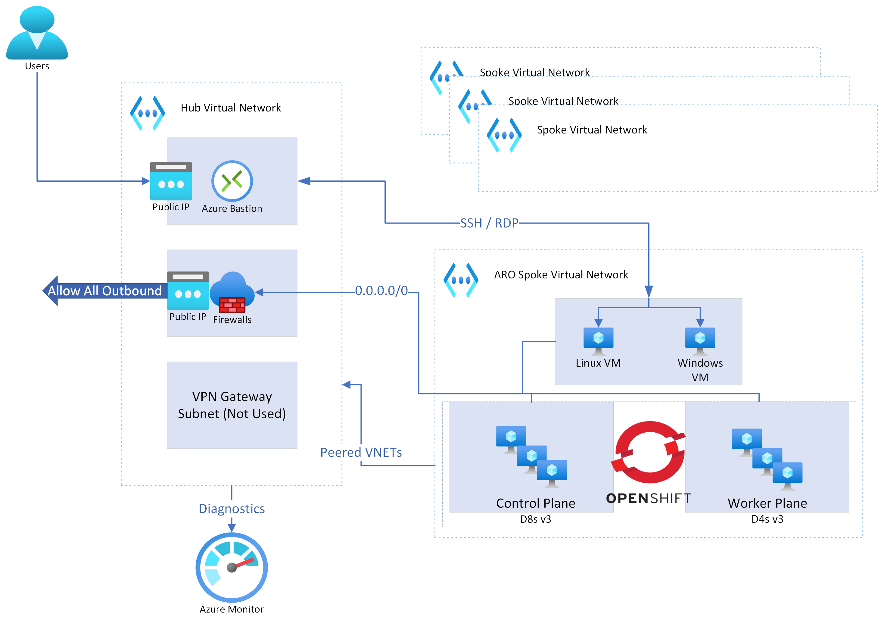

# Hub and Spoke ARO Example Deployment

The goal with this repo is to show an example of how to deploy a private, secure ARO and force-tunnel traffic through Azure Firewall in the Hub VNET. You can fork this repo and add/customize as needed.

Under the `hub-spoke-deployment` directory you will find the guide to deploying the architecture.

### Architecture

